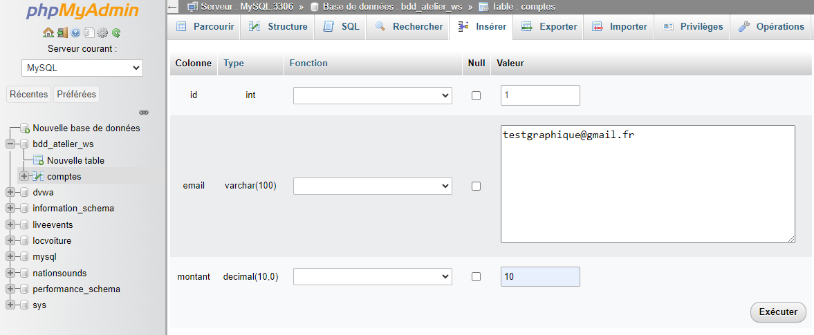
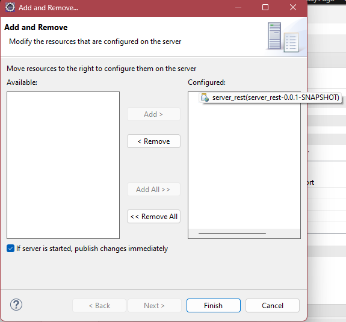

# Projet-Atelier-Services-Web

## Base de donnée (150 points)

### Serveur de base de donnée (20 points)

### Connexion avec l'interface graphique (5 points)

### Connexion avec la ligne de commande (20 points)

### Création de la base (avec l'interface graphique) (5 points)

### Création de la base de donnée (avec une requête SQL) (10 points)

### Affichage de l'encodage (Interface graphique) (5 points)

### Affichage de l'encodage (requête SQL) (5 points)

### Créer une table SQL (20 points)

### Insérer des données dans la table (15 points)

### Sélectionner des données (15 points)

### Mettre à jour des données (15 points)

### Supprimer des données (15 points)

## Installation de Eclipse JEE (50 points)

## Installation et configuration de l'environnement deprogrammation JEE (100 points)

### Importer les projets Webservice SOAP (50 points)

### Importer les projets webservice REST (50 points)

## Configuration de Tomcat (50 points)

## Démarrage du serveur d'application Tomcat (30 points)

## Démarrage du Client REST (30 points)

## Démarrage du Serveur SOAP (30 points)

## Démarrage du Client SOAP (30 points)

## Tester le webservice avec SOAP UI (75 points)

## Tester le webservice avec Advanced Rest Client (75 points)

## Ajout des commentaires dans les programmes (75 points)

## Programmation supplémentaire des clients et des serveurs (75points)

